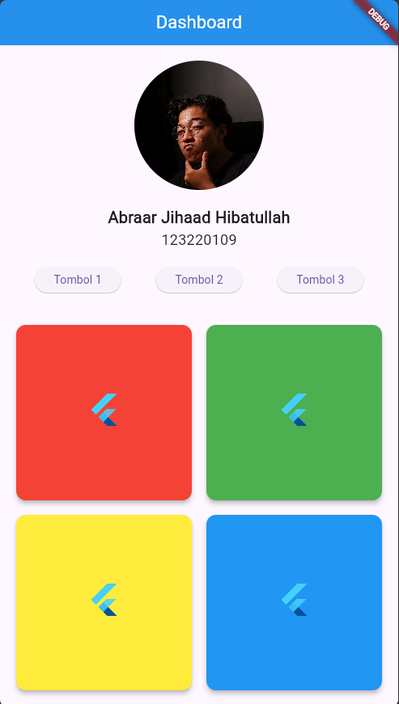

# Dashboard Flutter


Ini adalah aplikasi Flutter sederhana yang menampilkan **Dashboard** dengan beberapa elemen UI seperti **CircleAvatar**, **Teks**, **Tombol**, dan **Kartu** (Card). Aplikasi ini dirancang untuk memberi tampilan antarmuka pengguna yang menarik dan interaktif.

## Fitur

1. **CircleAvatar**: Menampilkan gambar profil pengguna di bagian atas.
2. **Text**: Menampilkan nama dan ID pengguna.
3. **Tombol**: 3 tombol yang sejajar di bawah nama.
4. **Kartu (Card)**: Kartu yang disusun 2x2 dengan gambar dan warna yang berbeda.

## Tampilan

Aplikasi ini memiliki struktur layout berikut:

- **AppBar** di bagian atas.
- **CircleAvatar** untuk gambar profil.
- Nama dan ID pengguna.
- Tombol yang sejajar di bawah nama.
- 2x2 **GridView** yang berisi kartu dengan gambar dan warna berbeda.

## Instalasi

1. **Clone repository**:
   ```bash
   git clone <url-repository>
